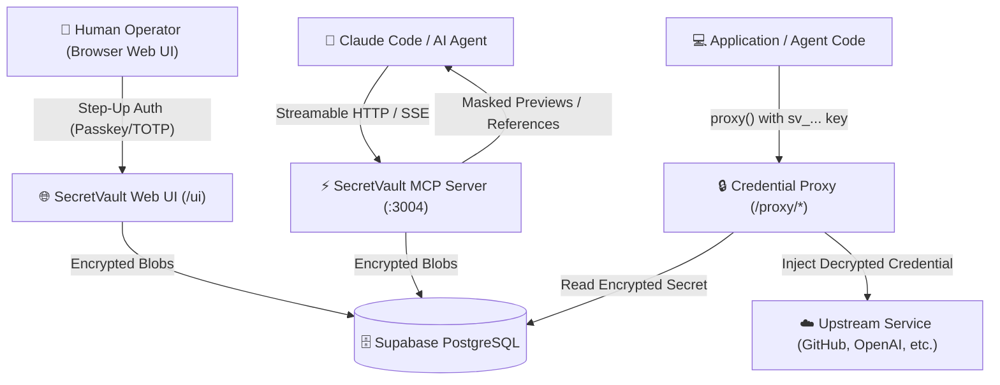

# SecretVault MCP

> **Bounded Egress Gateway & Secret Proxy for AI Agents and Applications.**
> Safely inject credentials into approved upstream requests while keeping raw credentials out of LLM agent prompt contexts.

---

## Why SecretVault?

Traditional secret managers return raw plaintext API keys and database passwords to applications. When AI agents (such as Claude Code or custom LLM tools) handle raw secret values, those secrets inevitably leak into LLM context streams, prompt logs, and telemetry data.

**SecretVault enforces a Bounded Egress Gateway Model:**

- 🛡️ **Bounded Egress Gateway Claim**: MCP tools, agent SDKs, and REST API calls cannot retrieve raw secret plaintexts. AI agents receive masked previews (`sk-live-***1234`) or proxy reference tokens (`sv://...`).
- 🔄 **Server-Side Credential Proxy**: Agents route requests through SecretVault's reverse proxy (`/proxy/:service/*`), which decrypts and injects real credentials server-side directly into outbound HTTP headers.
- 🌐 **Upstream Response Trust Boundary**: SecretVault injects credentials into outbound requests, but response bodies returned by third-party services reside within the upstream service's trust boundary. Current mitigations include HTTPS-by-default destinations, private-network rejection, and canonical origin validation; transparent response-body sanitization and universal path/method policy are not claimed.
- 🔑 **AES-256-GCM Encryption**: All secrets are encrypted locally using AES-256-GCM before being saved to Supabase/PostgreSQL.
- 🔐 **Human-Only Step-Up Auth**: High-risk Web UI operations (such as revealing raw secrets to human operators) require hardware WebAuthn Passkeys or TOTP 2FA assertion.

---

## Architecture Diagram



---

---

## Quickstart & Installation

### Option A: Automated 1-Line Server Installer (Recommended)

Deploy SecretVault with interactive guided prompts for master keys, passwords, and database connections:

```bash
curl -fsSL https://raw.githubusercontent.com/itsaygea/secretvault/main/install-server.sh | bash
```

---

### Option B: Interactive Developer Client Setup Wizard

Automatically connect developer AI tools (**Antigravity IDE**, **Claude Code**, **Claude Desktop**, **OpenCode**, **Codex**) to SecretVault:

```bash
curl -fsSL https://raw.githubusercontent.com/itsaygea/secretvault/main/install-client.sh | bash
```
*(Or via `npx @secretvault/mcp-server setup` when published).*

---

### Option C: Terminal Secret Manager CLI

Manage secrets directly from an SSH terminal without using the Web UI:

```bash
npx @secretvault/mcp-server secret list
npx @secretvault/mcp-server secret create
npx @secretvault/mcp-server secret rotate
npx @secretvault/mcp-server secret delete
```

---

### Option D: Manual Docker Compose Deployment

```bash
# 1. Clone repository & enter directory
git clone https://github.com/itsaygea/secretvault.git
cd secretvault

# 2. Prepare environment file
cp .env.example .env

# 3. Generate 32-byte master key & edit .env
openssl rand -hex 32
nano .env # Paste master key, Supabase, and direct PostgreSQL credentials

# 4. Restrict permissions & boot
chmod 600 .env
docker compose up -d

# 5. Verify health & open UI
curl http://localhost:3004/health/ready
# Open http://localhost:3004/ui in browser
```

> 📖 **Full Installation Guide**: See **[docs/install.md](docs/install.md)** for migration access, Caddy HTTPS, and prerequisites. Startup migrations run before the server accepts traffic.

---

## Documentation Index

- 🚀 **[Self-Host & Installation Guide](docs/install.md)** — Step-by-step AFFiNE-style Docker Compose deployment guide.
- 💻 **[Usage & Developer Integration Guide](docs/usage.md)** — Connecting Claude Code / Desktop MCP, using `@secretvault/client` and `@secretvault/admin`, and setting up Service Profiles.
- 📜 **[Versioned HTTP Contract](docs/openapi.json)** — OpenAPI 3.1 management/metadata schema and proxy contract surface.
- 🛡️ **[Security Architecture & Threat Model](docs/security.md)** — AES-256-GCM cipher details, Docker Secrets RAM-mount, and Passkey/TOTP step-up auth.
- 🔧 **[Operations & Troubleshooting](docs/ops.md)** — Database backups (`pg_dump`), disaster recovery, container upgrades, and break-glass CLI tools.

---

## Monorepo Layout

```
secretvault/
├── packages/
│   ├── shared/          # Crypto (AES-256-GCM), masking, types, naming helpers
│   ├── mcp-server/      # MCP server + REST API + Web UI + Proxy
│   ├── client/          # Proxy-only application client (@secretvault/client)
│   ├── admin/           # Management client (@secretvault/admin)
│   ├── bridge/          # Deprecated proxy compatibility adapter
│   └── sdk/             # Deprecated migration alias
├── supabase/migrations/ # PostgreSQL schema migrations (001 - 011)
├── docs/                # Public user guides (install, usage, security, ops)
├── Dockerfile           # Multi-stage production container build
└── docker-compose.yml   # Production Docker Compose distribution
```

---

## License

SecretVault is open-source software licensed under the **[MIT License](LICENSE)**.
